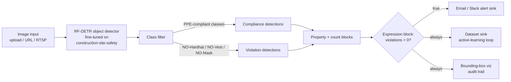

# Foreman

> The AI foreman that walks the site, watches the workers, and calls out the violations.

Foreman is a Roboflow-native computer vision demo for construction-site PPE compliance — detecting whether workers on a job site are wearing hardhats, masks, and safety vests, and alerting in real time when they aren't.

This repo is a portfolio rebuild of a 2023 master's capstone (hard-hat detection), packaged as a Solutions Architect application artifact for [Roboflow](https://roboflow.com). The point is to demonstrate end-to-end platform fluency: dataset → trained model → Roboflow Workflow → two deploy paths (hosted + edge).

---

## Status

**Planning stage.** PRD and Phase 1 execution plan are committed. Model training, Workflow build, and deploy scripts land in the upcoming build sessions. This README will be rewritten once the artifacts exist.

| Phase | Deliverable | Status |
|---|---|---|
| 1 — Train & validate | RF-DETR Small fine-tuned on the canonical [`construction-site-safety`](https://universe.roboflow.com/roboflow-universe-projects/construction-site-safety) dataset (717 imgs, 25 classes), baseline mAP documented | Planned |
| 2 — Workflow build | Roboflow Workflow: detection → class filter → property/count → expression block → alert + dataset sinks | Planned |
| 3 — Deploy two ways | Hosted (`inference-sdk` → `serverless.roboflow.com`) + local (`inference server start`), same `workflow.json` | Planned |
| 4 — Package & pitch | README rewrite, Loom walkthrough, LinkedIn writeup | Planned |

See [`Plans/P1-cheat-sheet.md`](Plans/P1-cheat-sheet.md) for the locked Phase 1 execution plan and [the PRD](roboflow-sa-capstone-rebuild-prd-v0.1.md) for full scope and rationale.

---

## Architecture (planned)



The expression block is where ML output becomes a business signal. That gate — and the three sinks it feeds — is the Solutions Architect conversation in one diagram: alerting (operations), active learning (model improvement), visualization (audit + reviewer trust).

---

## Strategic shape

Three causal links the artifact is built around:

> Master's capstone proves CV credibility → Roboflow rebuild proves platform fluency → SA-shaped demo proves the candidate already thinks like the role

Every Phase serves one of those links. If a proposed change doesn't, it's out of scope (see [PRD §1](roboflow-sa-capstone-rebuild-prd-v0.1.md)).

---

## Repo layout (target — phases fill this in)

```
foreman-cv/
├── README.md                                         # this file
├── roboflow-sa-capstone-rebuild-prd-v0.1.md          # source-of-truth PRD
├── Plans/                                            # planning artifacts
│   ├── P1-cheat-sheet.md
│   └── roboflow-workspace-setup-browser-prompt.md
├── workflow.json                                     # Phase 2 export
├── deploy/                                           # Phase 3 clients
│   ├── hosted_inference.py
│   └── local_inference.py
├── eval/                                             # Phase 1 artifacts
│   ├── baseline_metrics.md
│   └── sample_predictions/
├── .env.op                                           # 1Password reference file
└── .archon/                                          # repo-scoped Archon workflows
```

---

## Running it (after Phase 3 lands)

Both clients read Roboflow credentials from 1Password CLI via `op run`, not from a local `.env`. Install [1Password CLI](https://developer.1password.com/docs/cli/), sign in (`op signin`), then:

```bash
# Hosted — serverless.roboflow.com
op run --env-file=.env.op -- python deploy/hosted_inference.py

# Local — inference server on http://localhost:9001
pip install inference
inference server start
op run --env-file=.env.op -- python deploy/local_inference.py
```

The committed `.env.op` contains `op://...` references, not secrets — safe to read, resolves to real env vars at process start.

---

## Background

- **Original capstone** (2023): hard-hat detection on an ad-hoc dataset, standalone PyTorch model.
- **This rebuild** (2026): the canonical Roboflow dataset, [RF-DETR](https://blog.roboflow.com/rf-detr/) (Roboflow's March 2025 real-time detection release) as the primary model, hosted + edge deployment, full Workflow tooling end-to-end.

The 2023 model worked but never left a notebook. The 2026 rebuild ships it.

---

## License

MIT (committed in Phase 4).
