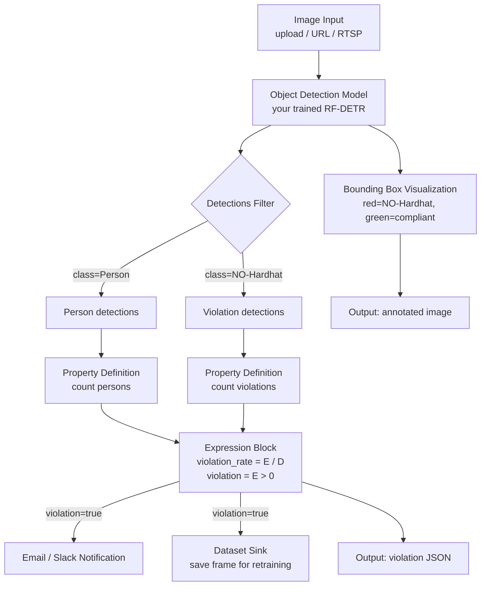

------

## title: Foreman — Roboflow SA Capstone Rebuild project: Foreman status: PRD v0.1 owner: Mike target: Roboflow Solutions Architect application created: 2026-05-18 philosophy: Phase 1-first delivery; ship narrow, expand only if Phase 1 lands

# Foreman — Roboflow SA Capstone Rebuild (PRD v0.1)

## 0. The name

**Foreman.** The AI foreman that walks the site, watches the workers, and calls out the violations. The metaphor does work in three places: it names the product, it frames the Loom narrative ("here's what the foreman saw"), and it gives the LinkedIn post a hook with personality. Use it consistently across repo, README, Loom, and post.

## 1. Strategic intent

Convert the 2023 master's capstone (hard-hat / job-site safety classifier) into **Foreman** — a Roboflow-native production demo of an automated job-site safety inspector — then use it as the differentiator on the Solutions Architect application.

**The wedge.** Roboflow's careers page says it plainly: *"One of the best ways to stand out amongst other applicants is to write about something you have built with Roboflow or contribute to one of our open source projects."* Most applicants will ignore that line. We will not.

**Causal chain this PRD is built on:**

> Master's capstone proves CV credibility → Roboflow rebuild proves platform fluency → SA-shaped demo proves you already think like the role → application converts from "stretch" to "memorable"

## 2. Success criteria

| #    | Criterion                                                    | Phase |
| ---- | ------------------------------------------------------------ | ----- |
| 1    | Trained model in a public Roboflow workspace, baseline mAP documented | P1    |
| 2    | Published Workflow with model + business logic + alerting + dataset sink | P2    |
| 3    | Two working deployments: hosted (cloud) + local (edge)       | P3    |
| 4    | 3–5 min Loom walkthrough framed as the SA narrative, not the academic narrative | P4    |
| 5    | Public GitHub repo with workflow.json, deploy code, writeup  | P4    |
| 6    | LinkedIn post live with causal-hook framing                  | P4    |
| 7    | Application submitted with Loom + repo links in cover note   | P4    |

**Phase 1 is the gate.** If P1 lands clean by Saturday noon, continue. If the dataset import or training stalls, drop to YOLO11n fallback before sinking time elsewhere.

## 3. Phase 1 — Train and validate (target: Sat AM, 3–4 hrs)

### 3.1 Dataset

**Primary:** [`roboflow-universe-projects/construction-site-safety`](https://universe.roboflow.com/roboflow-universe-projects/construction-site-safety)

- 717 images, published by Roboflow's own org account
- Classes: `Hardhat`, `NO-Hardhat`, `Mask`, `NO-Mask`, `Safety Vest`, `NO-Safety Vest`, `Person`, `Safety Cone`, `machinery`, `vehicle`
- **Why this one:** It's their canonical demo dataset. Using it signals you walked their happy path. Customer-facing SAs don't pick obscure datasets when the official one exists.

**Fallback for accuracy if Phase 1 yields weak mAP:** [`ppe-kit-detection/hardhat-safetyvest`](https://universe.roboflow.com/ppe-kit-detection/hardhat-safetyvest) — 22k images, 3 classes (head/helmet/vest).

### 3.2 Model

**Primary: RF-DETR.** Roboflow's March 2025 SOTA real-time release. The careers page itself links to it ([blog post](https://blog.roboflow.com/rf-detr/)). Using it is intentional signal.

**Fallback: YOLO11n.** Faster training queues on the free tier, smaller weights, easier edge deploy. Acceptable if RF-DETR queues stall.

### 3.3 Phase 1 deliverables

- [ ] Fork dataset into your workspace (`flowevolve-sa-demo` or similar)
- [ ] Trigger hosted training run on RF-DETR
- [ ] Capture training output: mAP@0.5, mAP@0.5:0.95, per-class precision/recall — these become your baseline screenshot
- [ ] Smoke-test 5 images in Model Playground; save a "best" and "worst" frame
- [ ] Document in `eval/baseline_metrics.md`

### 3.4 Phase 1 done = ship signal

When Phase 1 is done you should be able to answer in one sentence: *"My fine-tuned RF-DETR hits {X} mAP on the canonical construction-site dataset; here's a frame."* That sentence alone is enough to back a LinkedIn post. Everything after this is upside.

## 4. Phase 2 — Workflow build (target: Sat PM, 2–3 hrs)

### 4.1 Architecture



### 4.2 Block-by-block rationale

| Block                  | Purpose                        | SA narrative                                                 |
| ---------------------- | ------------------------------ | ------------------------------------------------------------ |
| Object Detection Model | Run RF-DETR                    | "Customer's fine-tuned model, swap in/out"                   |
| Detections Filter      | Split classes                  | "Different classes drive different actions"                  |
| Property Definition    | Count by class                 | "Translate detections into business metrics"                 |
| Expression block       | `if violations > 0 then alert` | **The bridge from ML output to business outcome — this is the SA's whole job** |
| Email / Slack sink     | Fire alert on violation        | "Customer cares about response time, not mAP"                |
| Dataset Sink           | Save violation frames          | "Closes the active learning loop — Roboflow's enterprise wedge" |
| Bounding Box Viz       | Visual overlay                 | "The demo screenshot that ends up on a customer's slide"     |

### 4.3 Why this Workflow is SA-grade, not toy

A toy demo stops at "model predicts bounding boxes." An SA-grade demo answers three questions a real customer asks:

1. **"How does this become an alert?"** → Expression block + notification sink
2. **"How does it get better over time?"** → Dataset sink for active learning
3. **"How do I see what it's doing?"** → Visualization block + JSON output

If anyone on the Roboflow team watches the Loom, they'll see you've already thought through the customer conversation. That is the entire test.

## 5. Phase 3 — Deploy two ways (target: Sun AM, 1–2 hrs)

Two deployments, two customer stories. Build both — even a thin version of each is a hundred times more credible than one polished version.

### 5.1 Hosted deployment

- Endpoint: `https://serverless.roboflow.com`
- Library: `pip install inference-sdk`
- Pattern: `client.run_workflow(workspace_name=..., workflow_id=..., images={...})`
- File: `deploy/hosted_inference.py`
- **Customer story:** *"Fastest time to value. No ops. Sub-second predictions, pay-per-call."*

### 5.2 Local / edge deployment

- Library: `pip install inference`
- Run the Inference server locally (`inference server start`)
- Same workflow.json, same SDK, different endpoint
- File: `deploy/local_inference.py`
- **Customer story:** *"Air-gapped, data-sovereignty, or latency-critical. Same workflow definition, runs on Jetson, x86, or Apple Silicon."*

### 5.3 Bonus if Sunday has slack

- Feed an RTSP stream from a phone IP camera (e.g. "IP Webcam" Android app) into the local Inference server
- Lets you demo *live* PPE detection on your own webcam feed
- Sells the edge story without needing a Jetson

## 6. Phase 4 — Package and pitch (target: Sun PM, 2–3 hrs)

### 6.1 GitHub repo structure

```
foreman/
├── README.md                    # The writeup (see §6.2)
├── workflow.json                # Exported Workflow definition
├── deploy/
│   ├── hosted_inference.py
│   └── local_inference.py
├── eval/
│   ├── baseline_metrics.md
│   └── sample_predictions/
│       ├── compliant.png
│       └── violation.png
├── assets/
│   ├── workflow_diagram.png    # Mermaid render of §4.1
│   └── architecture.png
└── LICENSE                      # MIT
```

Suggested GitHub slug: `flowevolve/foreman` (namespaced under your org to avoid collision with the thoughtbot Rails `foreman` Procfile manager). If using your personal account, prefer `foreman-cv` or `foreman-roboflow` as the slug — the displayed project name stays "Foreman" everywhere it matters.

### 6.2 README structure (writeup outline)

1. **The arc** — 3 sentences. Capstone (2023) → Roboflow rebuild as Foreman (2026) → what changed. Open with the metaphor: *"Foreman is the AI safety officer that doesn't take coffee breaks."*
2. **The problem** — Job site safety in 4 lines. Don't over-explain; the audience is Roboflow.
3. **The dataset** — Which one and why (construction-site-safety, Roboflow's own).
4. **The model** — RF-DETR, training config, baseline metrics, one good + one bad prediction frame.
5. **The Workflow** — Embed the Mermaid diagram, explain the SA rationale (lift from §4.2 table). Frame each block as "what the foreman does next."
6. **The deployments** — Hosted vs local, the two customer stories.
7. **What the capstone was missing** — Be specific. Don't trash the academic work; contrast it. The 2023 version was "model accuracy." Foreman is "model → alert → retrain loop."
8. **What I'd build next** — Two or three bullets. Multi-camera fan-out (foreman walks the whole site). Per-site dashboards. Severity scoring (no-hat near machinery > no-hat in a parking lot).

### 6.3 Loom walkthrough (3–5 min)

Tight outline. Time-box it.

| Time      | Beat                                                         |
| --------- | ------------------------------------------------------------ |
| 0:00–0:20 | The frame. "Meet Foreman — the AI safety officer that doesn't take coffee breaks. Started as my master's capstone in 2023. Rebuilt over a weekend as a Solutions Architect would scope it." Hook lives here. |
| 0:20–1:00 | Dataset + model. Show the Universe page, show the training output, show one prediction. |
| 1:00–2:30 | The Workflow. Walk each block, narrating *what the customer cares about*, not what the block does. |
| 2:30–3:30 | Both deployments. Hosted call returns JSON; local call returns JSON. Same workflow.json. |
| 3:30–4:00 | The active learning loop. Violations save back to a dataset. Mention this is the enterprise wedge. |
| 4:00–4:30 | Close. "Built this because the careers page said it's the best way to stand out. Happy to walk through how this thinking applies to your customer base." |

### 6.4 LinkedIn post — causal hook draft

```
Meet Foreman — the AI safety officer that doesn't take coffee breaks.

Master's capstone, 2023: hard-hat detection.
Six weeks. Three frameworks. No deploy story.
Beautiful confusion matrix in the appendix.

Same problem on Roboflow Workflows, this weekend:
Trained RF-DETR on their construction-site dataset.
Wired model → violation logic → email alert → dataset sink for retraining.
Deployed hosted AND on-device, same workflow definition.
One weekend. Total cost: $0.

The gap between the two wasn't model accuracy.
It was the platform layer that turns a model into a system.

I built Foreman because Roboflow's careers page says it's the
best way to stand out as an applicant. They're right —
forcing yourself through the platform end-to-end is the
fastest way to learn how an SA actually thinks on a call.

Repo + Loom in comments.
What I'd build next (and why) in the README.

#computervision #ppe #constructionsafety #roboflow
```

Tweak knobs:

- Tag `@Roboflow` and the recruiter / hiring manager once identified
- Pin to profile during the application window
- Drop a comment with the GitHub link + Loom link (LinkedIn deboosts external links in the post body)

### 6.5 Application cover note (Ashby form)

Three lines, in this order:

```
Built Foreman — a Roboflow-native rebuild of my master's CV
capstone on job-site PPE detection — the weekend before applying:
  Loom: [link]
  Repo: [link]

15+ years enterprise architecture, recently focused on AI
agent security through FlowEvolve. Strongest at the SA
conversation that translates platform capabilities into
the customer's compliance, ops, or revenue outcome.

The capstone gave me the CV foundation; building Foreman on
your platform was my forcing function to understand how a
Roboflow SA actually scopes and demos. Happy to walk through it.
```

## 7. Risks and mitigations

| Risk                                           | Likelihood | Mitigation                                                   |
| ---------------------------------------------- | ---------- | ------------------------------------------------------------ |
| Free tier RF-DETR training queue stalls        | Med        | Fallback to YOLO11n; document that this was a deliberate choice for fast iteration |
| Local Inference server fails on Apple Silicon  | Low        | Roboflow officially supports Mac; if blocked, hosted-only is acceptable for Phase 3 |
| Workflow Expression block syntax is unfamiliar | Low        | One blog post covers it end-to-end ([source](https://blog.roboflow.com/workflows-expressions)) |
| Time overrun bleeds into Monday                | Med        | **Hard stop:** if Phase 4 isn't done Sun 6PM, ship Phase 1 + 2 + LinkedIn post and apply Monday with whatever exists. A partial public artifact beats a polished private one. |
| Application closes before you ship             | Low        | Verify the role is still listed before starting; resubmit a brief "build coming" application now and follow up with the artifact if you're nervous |

## 8. What this whole exercise actually proves

Independent of whether Roboflow extends an offer, completing this PRD demonstrates:

- You can scope, build, and ship a vertical CV demo end-to-end in a weekend
- You can talk fluently about Workflow blocks, deployment patterns, and active learning
- You have a public CV portfolio piece that opens future doors (Implementation Engineer, AI presales at other CV co's, AgentForge cross-sell into vision-domain customers)

That's true whether or not this specific role lands. Build it for the option value.

## 9. Open questions for v0.2

- Does the Ashby form have a "portfolio" field, or do links go in cover letter only?
- Worth a quick LinkedIn search of Roboflow SAs to understand the team profile before tailoring the Loom?
- Should the writeup mention FlowEvolve / AgentForge at all, or stay focused on the capstone arc?
- ~~**Slug decision:** push as `flowevolve/foreman` (namespaced, clean), `mlydick/foreman-cv` (disambiguated), or `mlydick/foreman` (risk of search collision with the Rails Procfile tool)? Decide before first push.~~ **RESOLVED 2026-05-18:** project name remains **Foreman** everywhere user-facing; GitHub repo is **`miskaone/foreman-cv`**.
- Phase 5 (post-application): if no response in 10 days, follow-up with a v2 — "I added severity scoring and a multi-camera fan-out, here's what changed" — proves persistence + iteration